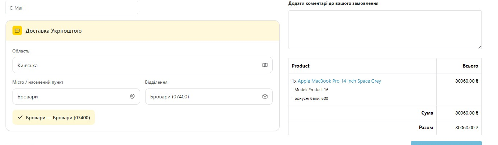
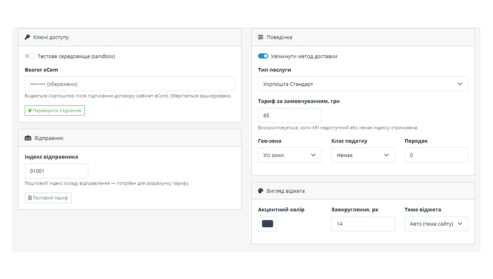

# Ukrposhta Shipping for OpenCart

<p align="center"></p>

Ukrposhta (Укрпошта) shipping integration for **OpenCart 4.x** — an in-checkout post-office picker backed by the official Ukrposhta Address Classifier, plus live domestic tariff calculation.

> **Scope of this release (1.0.0):** checkout picker + tariff. Shipment (barcode/ТТН) creation, sticker printing and cash-on-delivery are implemented but ship in a later update once verified end-to-end against a live contract.

## Features

- **Checkout picker** — customer chooses **region → city → post office**, powered by the official Ukrposhta Address Classifier (`address-classifier-ws`). The selected post index is stored on the order.
- **Live tariff** — domestic delivery price from the Ukrposhta eCom API (`/domestic/delivery-price`); a configurable flat rate is the fallback.
- **Geo-zone & tax rules** — standard OpenCart shipping controls (geo zone, tax class, sort order).
- **Appearance** — accent colour, corner radius and light/dark/auto theme so the widget matches your storefront.
- **Encrypted credentials** — the eCom Bearer is stored obfuscated at rest.
- **Full uk-ua + en-gb** admin and storefront language packs.

## Requirements

- OpenCart **4.0.2.0 – 4.1.x**
- PHP 8.0+
- A Ukrposhta **eCom contract** — the Address Classifier and tariff both authorise with an eCom **Bearer** issued by your Ukrposhta manager after signing the contract.

## Installation

1. Admin → **Extensions → Installer** → upload `ukrposhta.ocmod.zip`.
2. Admin → **Extensions → Shipping** → **Ukrposhta** → *Install* → *Edit*.
3. Click **Install** (creates tables/events/cron), paste your **Bearer**, set the sender post index, **Save**.
4. Click **Sync regions**, enable the method. The picker appears at checkout.

## Repository layout

```
upload/            files copied into the OpenCart root (admin/, catalog/, system/, install.json)
```

Build the installable archive by zipping the **contents** of `upload/` (so `install.json` sits at the archive root).

## Screenshots

**Checkout — post-office picker (region → city → office)**



**Admin — settings**



## Licence

GPL-3.0-or-later.


## 🔗 CatCode

Модуль розробляє і підтримує студія **[CatCode](https://catcode.com.ua)**.

- 📄 Сторінка модуля з документацією та ліцензією: **https://catcode.com.ua/modules/ukrposhta-%d0%b2%d0%b8%d0%b1%d1%96%d1%80-%d0%b2%d1%96%d0%b4%d0%b4%d1%96%d0%bb%d0%b5%d0%bd%d0%bd%d1%8f-%d1%82%d0%b0%d1%80%d0%b8%d1%84-%d0%b4%d0%bb%d1%8f-opencart-4-x/**
- 🧩 Усі наші модулі для OpenCart та WooCommerce: https://catcode.com.ua/modules/
- ✉️ Підтримка: catcode.info@gmail.com
